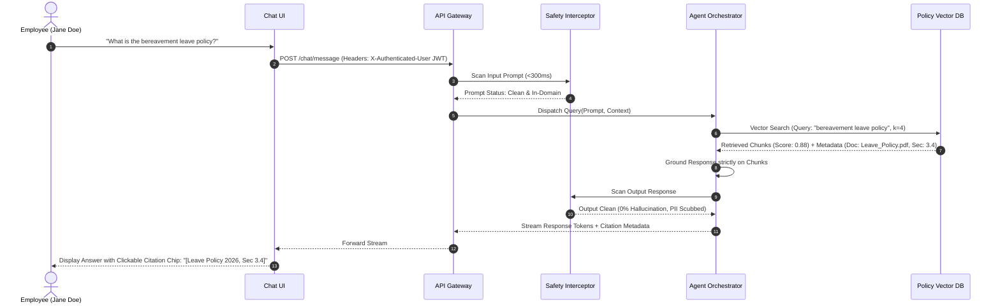
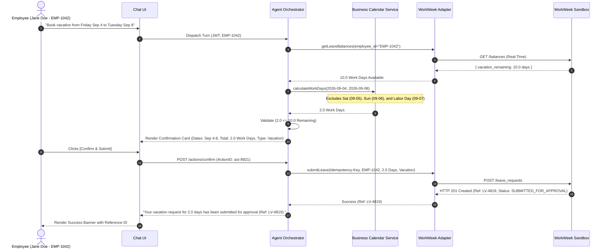
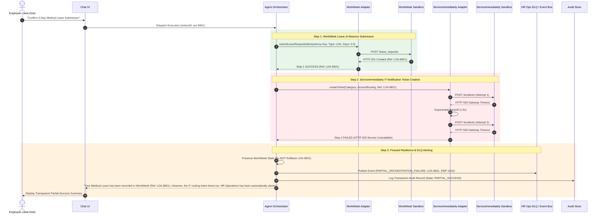
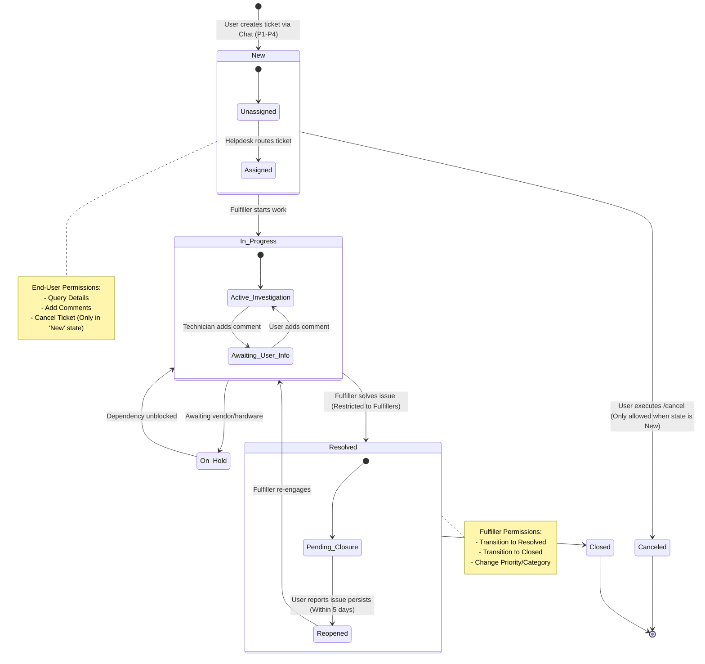
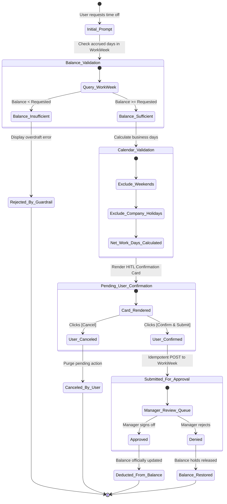
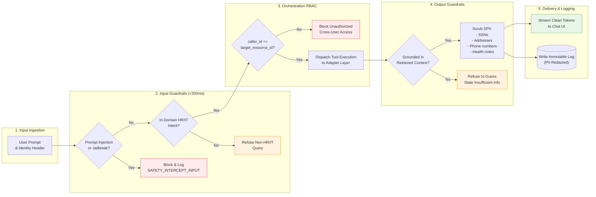
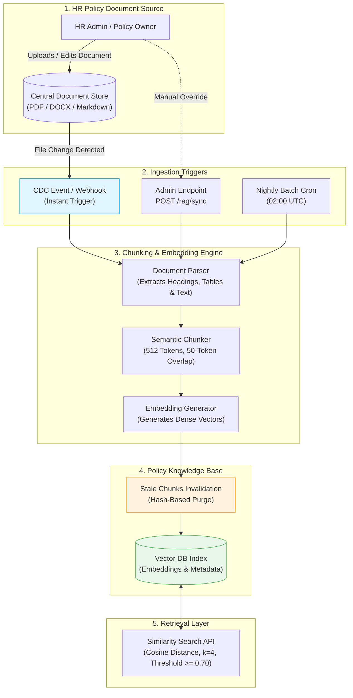

# HR Agentic Solution: Architecture & Workflow Diagrams (MVP 1)

This document contains the complete visual architectural specifications, sequence flows, state machines, and security pipelines for the **HR Agentic Solution (MVP 1)** using Mermaid diagrams.

---

## 1. High-Level System Architecture

This diagram details the end-to-end component topology, including the **Gateway Mock Identity Assertion Layer**, **Interaction Safety Interceptors**, **Agent Orchestration Engine**, **System Adapters**, and the **Dead-Letter Queue (DLQ)**.

```mermaid
flowchart TD
    subgraph Client_Layer ["1. Client Layer"]
        User(["Employee / Client Browser"])
        PersonaSelector["Test Persona Selector\n(Jane Doe / John Smith / Alice Brown)"]
        ChatUI["Web Chat UI\n(Token Streaming & HITL Cards)"]
        User <--> PersonaSelector
        User <--> ChatUI
    end

    subgraph Gateway_Layer ["2. API Gateway & Auth Proxy"]
        APIGateway["API Gateway\n(Rate Limiting & Session Router)"]
        AuthProxy["Mock Identity Assertion Service\n(Issues Signed JWT)"]
        ChatUI -->|HTTPS Request| APIGateway
        PersonaSelector -.->|Selects Identity| AuthProxy
        AuthProxy -->|Injects X-Authenticated-User| APIGateway
    end

    subgraph Security_Layer ["3. Interaction Safety & Governance"]
        InputGuard["Input Safety Guardrail\n(Prompt Injection & Jailbreak Filter)"]
        OutputGuard["Output Safety Guardrail\n(Hallucination Filter & PII Redactor)"]
        APIGateway -->|1. Raw Prompt + JWT| InputGuard
    end

    subgraph Core_Agent_Platform ["4. Agent Orchestration Platform"]
        SessionMgr["Session & Context Manager\n(Redis: 30m TTL / Reset)"]
        Orchestrator["Agent Orchestration Engine\n(Intent Parser & Tool Router)"]
        RBACFilter["Orchestration-Level RBAC\n(Enforces caller_id == target_id)"]
        
        InputGuard -->|2. Clean Prompt| Orchestrator
        Orchestrator <--> SessionMgr
        Orchestrator --> RBACFilter
    end

    subgraph Integration_Adapters ["5. System Integration Adapters"]
        WW_Adapter["WorkWeek HCM Adapter\n(Idempotent REST / Circuit Breaker)"]
        SI_Adapter["ServiceImmediately Adapter\n(Deduplication & Lifecycle Engine)"]
        VectorEngine["Policy RAG Engine\n(Semantic Search & Citations)"]
        
        RBACFilter -->|Authorized Tool Call| WW_Adapter
        RBACFilter -->|Authorized Tool Call| SI_Adapter
        RBACFilter -->|Authorized Tool Call| VectorEngine
    end

    subgraph Enterprise_Backends ["6. External Enterprise Services"]
        WorkWeek[("WorkWeek Sandbox\n(HCM & Leave Balances)")]
        ServiceImmediately[("ServiceImmediately Sandbox\n(ITSM & HRSD Incidents)")]
        VectorDB[("Policy Vector Database\n(Embeddings & Metadata)")]
        DocRepo[("HR Policy Document Repo\n(PDF / DOCX Guidelines)")]
        
        WW_Adapter <-->|Service Credential + Scoped Token| WorkWeek
        SI_Adapter <-->|Service Credential + Caller Context| ServiceImmediately
        VectorEngine <-->|Cosine Search (k=4)| VectorDB
        DocRepo -.->|Ingestion Webhook <= 1hr| VectorDB
    end

    subgraph Governance_Observability ["7. Governance, Audit & Dead-Letter Queue"]
        AuditStore[("Immutable Audit Database\n(PII-Masked Access Logs)")]
        DLQ[("HR Ops Dead-Letter Queue\n(Partial Failure Event Bus)")]
        
        Orchestrator -->|Async Audit Log| AuditStore
        Orchestrator -.->|On Chained Step Failure| DLQ
        Orchestrator -->|3. Generated Response| OutputGuard
        OutputGuard -->|4. Safe Stream| ChatUI
    end

    style InputGuard fill:#fff3cd,stroke:#ffc107,stroke-width:2px;
    style OutputGuard fill:#fff3cd,stroke:#ffc107,stroke-width:2px;
    style RBACFilter fill:#e8f5e9,stroke:#4caf50,stroke-width:2px;
    style DLQ fill:#ffebee,stroke:#f44336,stroke-width:2px;
    style WorkWeek fill:#e1f5fe,stroke:#03a9f4,stroke-width:2px;
    style ServiceImmediately fill:#e1f5fe,stroke:#03a9f4,stroke-width:2px;
```

---

## 2. Sequence Diagrams: Core User Workflows

### 2.1. Grounded Policy Q&A Flow (RAG with Citations)

Illustrates strict domain containment, similarity score gating ($\ge 0.70$), and deep-link citation generation.



---

### 2.2. Transactional Leave Booking with HITL Confirmation Flow

Illustrates real-time balance queries, business calendar holiday/weekend exclusion, interactive **Human-in-the-Loop (HITL)** confirmation, and idempotent submission to WorkWeek.



---

### 2.3. Resilient Medical Leave Chained Flow with DLQ Forward Recovery (UC-2.2)

Illustrates a multi-system workflow where WorkWeek succeeds, ServiceImmediately fails, and the system performs **Forward Escalation with Dead-Letter Queue (DLQ)** without rolling back the valid HCM state.



---

## 3. State Machines & Lifecycle Diagrams

### 3.1. Incident Ticket Lifecycle State Machine (ServiceImmediately)

Defines allowed state transitions, guardrails, and role boundaries (End-User vs. Technician/Fulfiller).



---

### 3.2. Leave Request Lifecycle State Machine (WorkWeek)

Illustrates the conversational booking flow from balance validation to manager approval.



---

## 4. Security & Safety Processing Pipeline

Illustrates how an incoming conversational turn is sanitized, authorized, and scrubbed for Sensitive Personally Identifiable Information (SPII).



---

## 5. Knowledge Base Sync & Ingestion Pipeline (RAG)

Illustrates how static HR documents are chunked, embedded, and kept synchronized within the $\le 1\text{ hour}$ SLA.


