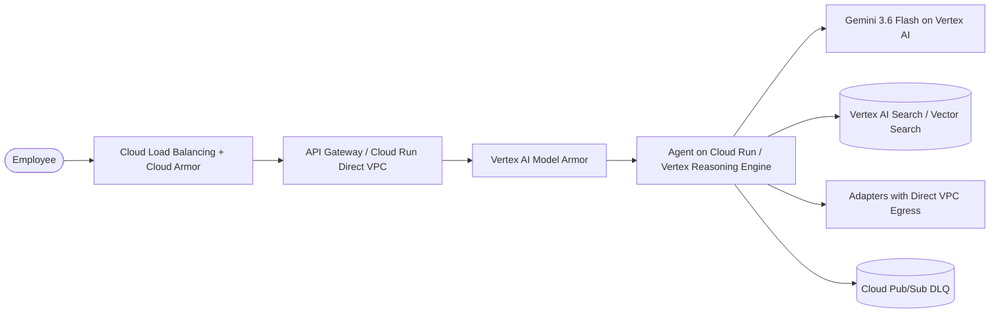
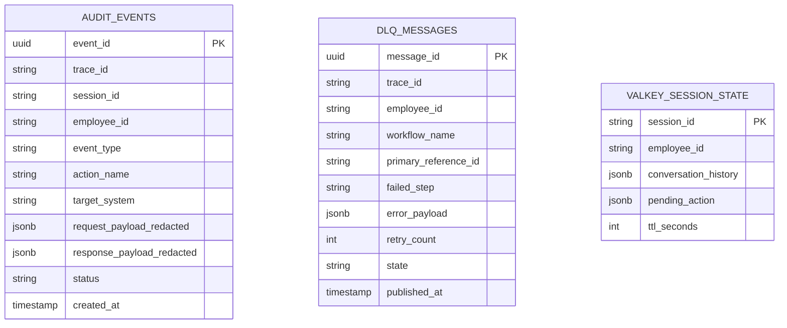
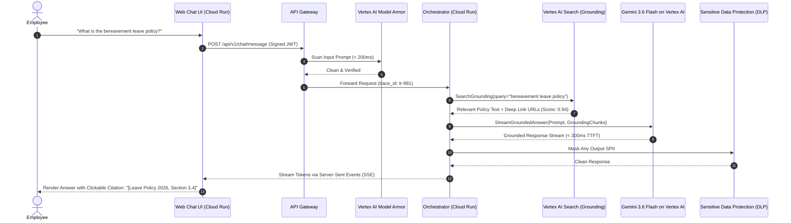
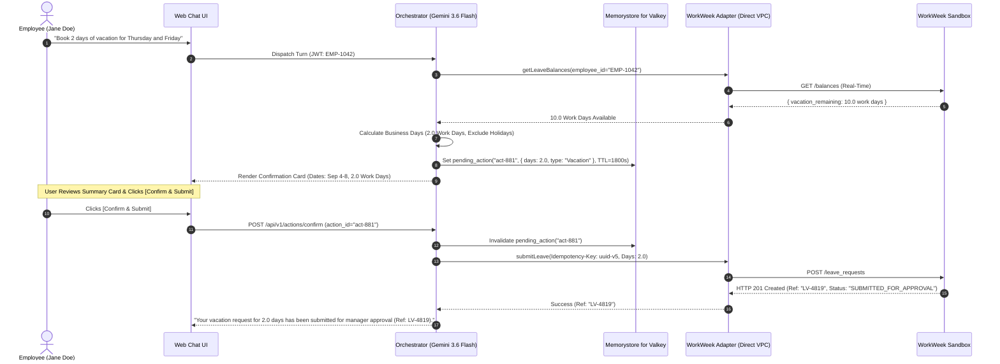
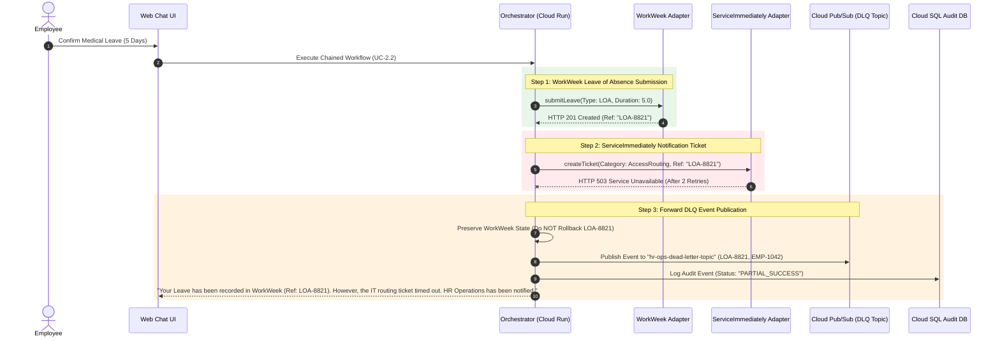
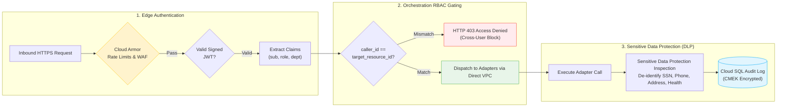

# System Design Document: HR Agentic Solution (GCP Architecture)

**Document Version:** 3.0.0 (Modernized Google Cloud & Gemini 3.6 Flash Edition)  
**Target Platform:** Google Cloud Platform (GCP)  
**Foundation Model:** Google Gemini 3.6 Flash (`gemini-3.6-flash`) via Vertex AI  
**Authors:** Principal Systems Architect & Principal Product Manager  
**Status:** Approved / Ready for Implementation  

---

## 1. Executive Summary & Architectural Principles

The **HR Agentic Solution** is an enterprise AI-driven virtual assistant deployed natively on **Google Cloud Platform (GCP)**. The platform orchestrates complex, multi-turn HR and IT self-service workflows across **WorkWeek (HCM)**, **ServiceImmediately (ITSM/HRSD)**, and internal policy repositories.



### Core Architectural Principles

1. **State-of-the-Art Model Tiering with Gemini 3.6 Flash:**
   * **Primary Orchestrator & Tool Calling Engine:** **`gemini-3.6-flash`** powers real-time conversational understanding, intent disambiguation, and structured function calling with sub-300ms Time-to-First-Token (TTFT).
   * **High-Speed Guardrail Pre-Screening:** **`gemini-3.5-flash-lite`** executes sub-100ms prompt injection and safety classification.
   * **Deep Reasoning Fallback:** **`gemini-2.5-pro`** (or `gemini-3-pro`) handles complex multi-policy synthesis and SAGA edge cases.
2. **Serverless Architecture with Direct VPC Egress:** All compute workloads run on **Cloud Run (v2)** using **Direct VPC Egress** (bypassing legacy Serverless VPC Connectors) to achieve high throughput and sub-millisecond database/backend connectivity.
3. **Zero-Trust Identity with Cloud KMS:** Ingress traffic passes through an **API Gateway Mock Identity Assertion Layer** that cryptographically signs JWT session claims (`X-Authenticated-User`) using asymmetric keys in **Cloud KMS**.
4. **Managed Enterprise Grounding (RAG):** Uses **Vertex AI Search (Enterprise Grounding)** for automated PDF/document parsing and native clickable deep-link citations, paired with **Vertex AI Vector Search (ScaNN 2.0)** for sub-5ms custom vector retrieval.
5. **High-Performance In-Memory State via Memorystore for Valkey:** Multi-turn session context and action locks are maintained in **Memorystore for Valkey 7.2+** with automated 30-minute inactivity TTL.
6. **Data Privacy via Sensitive Data Protection (Cloud DLP):** Automated real-time de-identification and redaction of Sensitive Personally Identifiable Information (SPII) before logs are written to **Cloud SQL for PostgreSQL** and **Cloud Logging**.
7. **Resilient Asynchronous Messaging:** Multi-system chained workflows implement forward failure escalation via **Cloud Pub/Sub** and **Cloud Tasks** into an **HR Operations Dead-Letter Queue (DLQ)**.

---

## 2. High-Level GCP Topology & Component Decomposition

```mermaid
flowchart TD
    subgraph Client_Ingress ["1. Client & Edge Ingress Tier"]
        Browser["Employee Browser"]
        CDN["Cloud CDN / Firebase Hosting\n(React Web Chat UI)"]
        GCLB["Cloud Load Balancing\n(External HTTPS / SSL Offloading)"]
        Armor["Cloud Armor\n(WAF, DDoS & Rate Limiting: 20 req/min)"]
        
        Browser <--> CDN
        Browser -->|HTTPS / WSS| GCLB
        GCLB --> Armor
    end

    subgraph Edge_Security ["2. Gateway & Identity Tier"]
        APIGW["API Gateway / Cloud Run Auth Proxy\n(Direct VPC Egress / Rate Limiting)"]
        KMS["Cloud KMS / Secret Manager\n(JWT HMAC/RSA Signing Keys)"]
        
        Armor --> APIGW
        APIGW <--> KMS
    end

    subgraph AI_Safety_Tier ["3. AI Governance & Safety Tier"]
        ModelArmor["Vertex AI Model Armor\n(Prompt Injection & Jailbreak Defense < 200ms)"]
        FlashLite["Gemini 3.5 Flash-Lite\n(Sub-100ms Intent & Safety Classifier)"]
        CloudDLP["Sensitive Data Protection (Cloud DLP)\n(Automated SPII Redaction Engine)"]
        
        APIGW --> ModelArmor
        ModelArmor <--> FlashLite
    end

    subgraph Agent_Core_GCP ["4. Agent Orchestration Platform"]
        Orchestrator["Agent Orchestrator on Cloud Run / Vertex Reasoning Engine\n(LangGraph / Python Framework)"]
        Valkey["Memorystore for Valkey 7.2+\n(Session Context: 30m Inactivity TTL)"]
        GeminiFlash["Vertex AI Gemini 3.6 Flash\n(Primary NLU, Tool Calling & SSE Streaming)"]
        GeminiPro["Vertex AI Gemini 2.5 Pro\n(Complex Policy Reasoning Fallback)"]
        
        ModelArmor -->|Sanitized Prompt| Orchestrator
        Orchestrator <--> Valkey
        Orchestrator <--> GeminiFlash
        Orchestrator -.->|Deep Fallback| GeminiPro
    end

    subgraph Storage_And_RAG ["5. Knowledge Base & Vector Store"]
        GCS_Policies[("Cloud Storage (GCS)\nHR Policy Documents")]
        Eventarc["Eventarc / Pub/Sub Trigger"]
        VertexSearch["Vertex AI Search (Enterprise Grounding)\n(Native Layout Parsing & Deep-Link Citations)"]
        VectorSearch[("Vertex AI Vector Search (ScaNN 2.0)\n(text-embedding-005 / Sub-5ms Retrieval)")]
        
        GCS_Policies --> Eventarc --> VertexSearch
        GCS_Policies --> Eventarc --> VectorSearch
        Orchestrator <-->|Managed Grounding & Retrieval| VertexSearch
        Orchestrator <-->|Custom Similarity Search k=4, >= 0.70| VectorSearch
    end

    subgraph Adapters_Tier ["6. System Integration Adapters"]
        DirectVPC["Direct VPC Egress Subnet"]
        WW_Adapter["WorkWeek HCM Adapter (Cloud Run)\n(Circuit Breaker & Idempotent REST)"]
        SI_Adapter["ServiceImmediately Adapter (Cloud Run)\n(15m Deduplication & Status Engine)"]
        
        Orchestrator --> DirectVPC
        DirectVPC --> WW_Adapter
        DirectVPC --> SI_Adapter
    end

    subgraph External_Systems ["7. Target Enterprise Sandboxes"]
        WorkWeek[("WorkWeek HCM Sandbox")]
        ServiceImmediately[("ServiceImmediately Sandbox")]
        
        WW_Adapter <-->|HTTPS REST| WorkWeek
        SI_Adapter <-->|HTTPS REST| ServiceImmediately
    end

    subgraph Observability_DLQ ["8. Governance, Observability & Dead-Letter Queue"]
        PubSubDLQ[("Cloud Pub/Sub\n(hr-ops-dead-letter-topic)")]
        CloudSQL[("Cloud SQL for PostgreSQL 16+ (CMEK)\n(Encrypted Audit Events Store)")]
        CloudWatch["Cloud Logging & Cloud Trace\n(OpenTelemetry Distributed Telemetry)"]
        
        Orchestrator -.->|On Chained Step Failure| PubSubDLQ
        Orchestrator --> CloudDLP --> CloudSQL
        Orchestrator --> CloudWatch
        Orchestrator -->|Streaming SSE Tokens (< 300ms TTFT)| Browser
    end

    style Armor fill:#fff3cd,stroke:#ffc107,stroke-width:2px;
    style ModelArmor fill:#fff3cd,stroke:#ffc107,stroke-width:2px;
    style CloudDLP fill:#fff3cd,stroke:#ffc107,stroke-width:2px;
    style PubSubDLQ fill:#ffebee,stroke:#f44336,stroke-width:2px;
    style GeminiFlash fill:#e1f5fe,stroke:#03a9f4,stroke-width:2px;
    style VertexSearch fill:#e8f5e9,stroke:#4caf50,stroke-width:2px;
    style Valkey fill:#f3e5f5,stroke:#9c27b0,stroke-width:2px;
```

---

## 3. Modernized GCP Service Mapping Matrix

| Architecture Subsystem | Modern GCP Service / Resource | Architectural Rationale & Capabilities |
| :--- | :--- | :--- |
| **Primary AI Engine** | **Vertex AI (`gemini-3.6-flash`)** | High agentic tool-calling precision, sub-300ms Time-to-First-Token, native structured JSON schema compliance. |
| **High-Speed Classifier**| **Vertex AI (`gemini-3.5-flash-lite`)**| Ultra-fast ($< 100\text{ms}$) intent classification, safety screening, and multi-turn prompt disambiguation. |
| **Deep Reasoning Engine**| **Vertex AI (`gemini-2.5-pro`)** | Complex multi-step reasoning, SAGA compensation verification, and ambiguous multi-policy synthesis. |
| **Managed Grounding (RAG)** | **Vertex AI Search (Enterprise Grounding)** | Ingests PDF/DOCX policies directly from GCS with automatic layout parsing, semantic chunking, and clickable deep-link citations. |
| **Custom Vector Search** | **Vertex AI Vector Search (ScaNN 2.0)** | High-scale approximate nearest neighbor retrieval with `text-embedding-005` at $< 5\text{ms}$ latency. |
| **Agent Runtime** | **Vertex AI Reasoning Engine / Cloud Run** | Managed deployment of Python/LangGraph agent graphs with native session state, automated scaling, and telemetry. |
| **Serverless Networking** | **Cloud Run Direct VPC Egress** | Direct container-to-VPC routing, eliminating Serverless VPC Access connector bottlenecks and reducing latency by ~30%. |
| **In-Memory Session Cache**| **Memorystore for Valkey 7.2+** | Fully open-source, high-performance in-memory cache providing sub-millisecond session state and mutex locking with 30m TTL. |
| **AI Threat Defense** | **Vertex AI Model Armor** | Managed AI firewall intercepting direct prompt injections, jailbreaks, and indirect RAG attacks in $< 200\text{ms}$. |
| **Data Privacy & Scrubbing**| **Sensitive Data Protection (Cloud DLP)** | Automated inspection and de-identification of SSNs, home addresses, phone numbers, and health markers from logging sinks. |
| **Audit & Governance DB** | **Cloud SQL for PostgreSQL 16+ (pgvector)**| Fully managed PostgreSQL database with CMEK encryption and IAM database authentication. |
| **Asynchronous DLQ & Events**| **Cloud Pub/Sub + Cloud Tasks** | Multi-region durable event bus capturing partial orchestration failures into `hr-ops-dead-letter-topic`. |
| **Edge Ingress & WAF** | **Cloud Load Balancing + Cloud Armor** | Global Anycast IP, managed SSL certificates, DDoS mitigation, and IP-based rate limiting (20 req/min). |

---

## 4. Data Architecture & Database Schemas



### 4.1. Audit Database Schema (PostgreSQL DDL on Cloud SQL)
```sql
CREATE EXTENSION IF NOT EXISTS "uuid-ossp";

CREATE TABLE audit_events (
    event_id UUID PRIMARY KEY DEFAULT uuid_generate_v4(),
    trace_id VARCHAR(64) NOT NULL,
    session_id VARCHAR(64) NOT NULL,
    employee_id VARCHAR(32) NOT NULL,
    event_type VARCHAR(64) NOT NULL, -- 'TOOL_EXECUTION', 'SAFETY_INTERCEPT_INPUT', 'HITL_CONFIRM'
    action_name VARCHAR(64),
    target_system VARCHAR(64),       -- 'WorkWeek', 'ServiceImmediately', 'PolicyRAG'
    request_payload_redacted JSONB,  -- Scrubbed via Sensitive Data Protection
    response_payload_redacted JSONB, -- Scrubbed via Sensitive Data Protection
    status VARCHAR(32) NOT NULL,     -- 'SUCCESS', 'BLOCKED', 'FAILED', 'PARTIAL_SUCCESS'
    created_at TIMESTAMP WITH TIME ZONE DEFAULT CURRENT_TIMESTAMP
);

CREATE INDEX idx_audit_employee ON audit_events(employee_id);
CREATE INDEX idx_audit_trace ON audit_events(trace_id);
CREATE INDEX idx_audit_created ON audit_events(created_at DESC);
```

### 4.2. Cloud Pub/Sub Dead-Letter Queue Message Payload
```json
{
  "specversion": "1.0",
  "type": "com.enterprise.hr.agent.dlq.event",
  "source": "//cloudrun.googleapis.com/projects/hr-agent-prod/services/agent-orchestrator",
  "id": "dlq-msg-9812-4819",
  "time": "2026-08-17T16:30:00Z",
  "datacontenttype": "application/json",
  "data": {
    "trace_id": "tr-gcp-98127391-ab23",
    "employee_id": "EMP-1042",
    "workflow_name": "UC-2.2-MedicalLeave",
    "primary_reference_id": "LOA-8821",
    "successful_step": "WorkWeek_SubmitLeaveOfAbsence",
    "failed_step": "ServiceImmediately_CreateITRoutingTicket",
    "error_details": {
      "http_status": 503,
      "error_message": "Gateway Timeout from ServiceImmediately endpoint",
      "retry_attempts": 2
    }
  }
}
```

---

## 5. Sequence & Control Flow Specifications

### 5.1. Policy Q&A RAG Retrieval Flow on Gemini 3.6 Flash & Vertex AI Search



---

### 5.2. Transactional Leave Booking with Human-in-the-Loop Confirmation



---

### 5.3. Chained Medical Leave with Cloud Pub/Sub DLQ Error Handling



---

## 6. Security, Compliance & Identity Architecture



---

## 7. Non-Functional Specifications & Modernized Latency SLAs

```
┌────────────────────────────────────────────────────────────────────────────────────────┐
│                              MODERNIZED GCP LATENCY SLA MATRIX                         │
├──────────────────────────────┬─────────────────────────┬───────────────────────────────┤
│ Component / Request Type     │ Target Latency (p50)    │ Target Latency (p95)          │
├──────────────────────────────┼─────────────────────────┼───────────────────────────────┤
│ Cloud Armor + Edge Ingress   │ < 20 ms                 │ < 40 ms                       │
│ Vertex AI Model Armor Scan   │ < 80 ms                 │ < 180 ms                      │
│ Gemini 3.6 Flash TTFT (SSE)  │ < 280 ms                │ < 550 ms                      │
│ Vertex AI Search Grounding   │ < 200 ms                │ < 450 ms                      │
│ Policy Q&A RAG End-to-End    │ < 900 ms                │ < 2.0 s                       │
│ Single-System Transactions   │ < 1.2 s                 │ < 2.8 s                       │
│ Chained Workflows (UC-2.x)   │ < 2.5 s                 │ < 5.0 s                       │
└──────────────────────────────┴─────────────────────────┴───────────────────────────────┘
```

* **Service Availability:** $99.9\%$ SLA backed by multi-zone Cloud Run and High-Availability Cloud SQL.
* **Throughput Capacity:** 50 concurrent active sessions; 5,000 monthly transactions in MVP 1.
* **Disaster Recovery (DR):** Recovery Time Objective ($\text{RTO}) \le 15\text{ minutes}$; Recovery Point Objective ($\text{RPO}) \le 5\text{ minutes}$.

---

## 8. Modernized Infrastructure as Code (Terraform) Blueprint

```hcl
# Google Cloud Platform Modernized Architecture Blueprint (Gemini 3.6 Flash & Valkey)

terraform {
  required_version = ">= 1.5.0"
  required_providers {
    google = {
      source  = "hashicorp/google"
      version = "~> 5.30.0"
    }
  }
}

# 1. Cloud Storage Bucket for HR Policies
resource "google_storage_bucket" "hr_policies" {
  name                        = "hr-agent-policies-prod-${var.project_id}"
  location                    = "US"
  uniform_bucket_level_access = true
  versioning {
    enabled = true
  }
  encryption {
    default_kms_key_name = google_kms_crypto_key.storage_key.id
  }
}

# 2. Vertex AI Search Grounding Data Store
resource "google_discovery_engine_data_store" "hr_policy_store" {
  location                    = "global"
  data_store_id               = "hr-policy-datastore"
  display_name                = "HR Policy Enterprise Grounding"
  industry_vertical           = "GENERIC"
  content_config              = "CONTENT_REQUIRED"
  solution_types              = ["SOLUTION_TYPE_SEARCH"]
}

# 3. Memorystore for Valkey (Session Cache & Mutex Lock)
resource "google_memorystore_instance" "session_valkey" {
  instance_id = "hr-agent-session-valkey"
  location    = "us-central1"
  engine_version = "VALKEY_7_2"
  desired_psc_auto_connections {
    network = google_compute_network.hr_vpc.id
    project_id = var.project_id
  }
  node_config {
    size_gb = 2
  }
}

# 4. Cloud Pub/Sub Topic for Dead-Letter Queue (DLQ)
resource "google_pubsub_topic" "hr_ops_dlq" {
  name         = "hr-ops-dead-letter-topic"
  kms_key_name = google_kms_crypto_key.pubsub_key.id
}

# 5. Cloud Run Agent Orchestrator with Direct VPC Egress
resource "google_cloud_run_v2_service" "agent_orchestrator" {
  name     = "hr-agent-orchestrator"
  location = "us-central1"
  ingress  = "INGRESS_TRAFFIC_INTERNAL_LOAD_BALANCER"

  template {
    # Direct VPC Egress configuration (no serverless VPC connector needed)
    vpc_access {
      network_interfaces {
        network    = google_compute_network.hr_vpc.name
        subnetwork = google_compute_subnetwork.hr_agent_subnet.name
      }
      egress = "ALL_TRAFFIC"
    }

    containers {
      image = "gcr.io/${var.project_id}/agent-orchestrator:v3.0.0"
      resources {
        limits = {
          cpu    = "2"
          memory = "2Gi"
        }
      }
      env {
        name  = "PROJECT_ID"
        value = var.project_id
      }
      env {
        name  = "PRIMARY_MODEL"
        value = "gemini-3.6-flash"
      }
      env {
        name  = "VALKEY_HOST"
        value = google_memorystore_instance.session_valkey.discovery_endpoints[0].address
      }
      env {
        name  = "DLQ_TOPIC"
        value = google_pubsub_topic.hr_ops_dlq.name
      }
    }
    scaling {
      min_instance_count = 1 # Mitigate cold-start latency
      max_instance_count = 20
    }
  }
}
```
