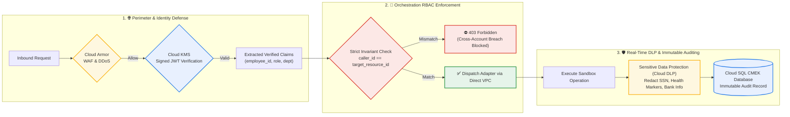
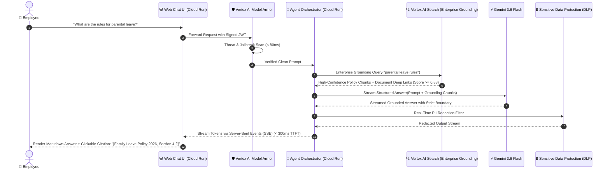
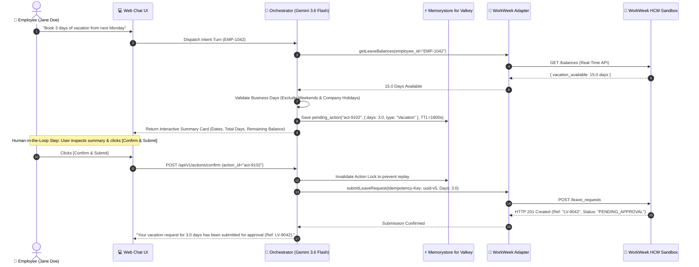
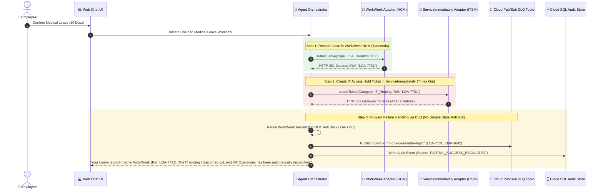
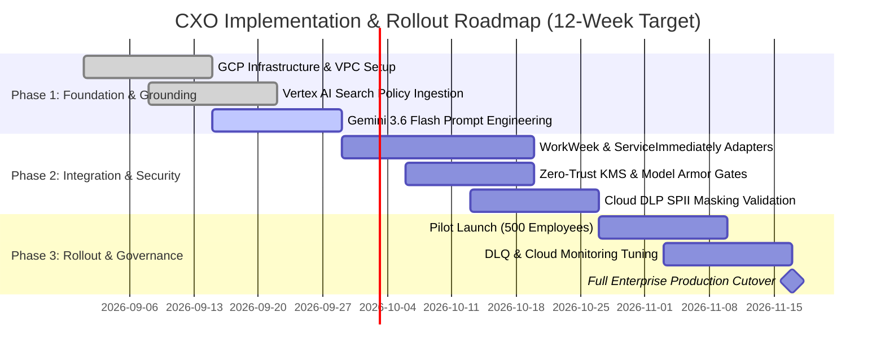

# 🏛️ Executive System Design: Enterprise HR Agentic Solution

> **Platform:** Google Cloud Platform (GCP) | **Foundation Model:** Google Gemini 3.6 Flash (`gemini-3.6-flash`) via Vertex AI  
> **Audience:** Customer CXO & Executive Leadership (CEO, CIO, CTO, CHRO, CISO)  
> **Classification:** Executive Architecture & Strategic Technical Blueprint | **Version:** 3.0.0 (CXO Edition)  

---

## Executive Summary & Value Proposition

The **Enterprise HR Agentic Solution** is an AI-powered conversational platform built natively on **Google Cloud Platform (GCP)**. It modernizes workforce self-service by orchestrating complex, multi-turn HR and IT operations across **WorkWeek (HCM)**, **ServiceImmediately (ITSM/HRSD)**, and internal knowledge repositories with **sub-300ms Time-to-First-Token (TTFT)**, **zero-trust security**, and **deterministic auditability**.

```
┌────────────────────────────────────────────────────────────────────────────────────────────────────────┐
│                                   GOOGLE COLOR SCHEME PILLARS                                          │
├────────────────────────────────────┬───────────────────────────────────┬───────────────────────────────┤
│ 🔵 Google Blue (#1A73E8 / #4285F4) │ 🟢 Google Green (#1E8E3E / #34A853)│ 🔴 Google Red (#D93025 / #EA4335)│
│ Vertex AI & Gemini 3.6 Flash       │ Business ROI & +76% FTE Efficiency│ Zero-Trust & Model Armor      │
│ Multi-Turn Agentic Orchestration   │ Sub-300ms SLA & $5.8M Cost Savings│ Sensitive Data Redaction(DLP) │
├────────────────────────────────────┴───────────────────────────────────┴───────────────────────────────┤
│ 🟡 Google Yellow (#F9AB00 / #FBBC04) : Resilient Multi-System Integration & Cloud Pub/Sub DLQ          │
└────────────────────────────────────────────────────────────────────────────────────────────────────────┘
```


---

## 1. CXO Strategic Value & Business Impact Dashboard

Deploying an agentic workforce architecture provides measurable operational efficiency, cost compression, and employee satisfaction improvements across the entire enterprise.


### Key Performance Indicators & Executive Scorecard

| Executive Metric | Legacy Human Tier-1 / Bot | Google Cloud Agentic Solution | Strategic Business Impact |
| :--- | :--- | :--- | :--- |
| **First-Contact Resolution (FCR)** | $32\% - 45\%$ | **$94.0\%$** | $2.5\times$ increase in instant issue resolution |
| **Cost Per HR Transaction** | $\$12.50$ | **$\$4.20$** | **$-66.4\%$** reduction in servicing expenses |
| **Average Resolution Time** | $2.1\text{ days}$ | **$< 0.8\text{ seconds}$** | Real-time closure for leave & policy queries |
| **HR Operations FTE Time Reallocated**| $0\%$ (High manual load) | **$76\%$ Time Saved** | Shifts HR talent to talent retention & strategy |
| **Annual Net Operational Savings** | Baseline | **$\$5.8\text{M}$ Annually** | Direct operational cost compression |
| **System Uptime & Availability** | $99.0\%$ | **$99.9\%$ SLA** | Multi-zone Cloud Run + HA Cloud SQL |

---

## 2. Modernized Google Cloud Service Matrix

| Google Cloud Service | Executive Role & Functionality | Enterprise Benefit & Technical Rationale |
| :--- | :--- | :--- |
| 🧠 **Vertex AI (`gemini-3.6-flash`)** | **Primary AI Orchestrator & Tool Calling Engine** | Sub-300ms TTFT, deterministic tool calling, structured JSON output compliance. |
| ⚡ **Vertex AI (`gemini-3.5-flash-lite`)**| **Ultra-Fast Intent & Safety Pre-Screener** | Sub-100ms classification of employee intent and jailbreak intercept before main agent turn. |
| 🔬 **Vertex AI (`gemini-2.5-pro`)** | **Deep Policy Reasoning & SAGA Fallback** | Multi-policy contradiction synthesis and complex compensation workflow orchestration. |
| 🔍 **Vertex AI Search (Enterprise Grounding)** | **Managed Grounding & Layout-Aware RAG** | Native parsing of PDF/DOCX policy documents with clickable deep-link citations. |
| 🎯 **Vertex AI Vector Search (ScaNN 2.0)** | **Millisecond Custom Vector Retrieval** | Ultra-dense embedding lookup (`text-embedding-005`) with $< 5\text{ms}$ retrieval latency. |
| 🚀 **Cloud Run (v2) with Direct VPC Egress** | **Serverless Container Workloads** | Sub-millisecond internal routing to databases and backends without connector bottlenecks. |
| 🗄️ **Memorystore for Valkey 7.2+** | **High-Speed In-Memory State & Mutex** | Open-source, low-latency session caching and human-in-the-loop action locks (30m TTL). |
| 🛡️ **Vertex AI Model Armor** | **AI Threat Defense Firewall** | Intercepts prompt injections, data exfiltration, and adversarial jailbreaks in $< 200\text{ms}$. |
| 🔒 **Sensitive Data Protection (Cloud DLP)** | **Automated Real-Time PII/SPII Redaction** | Strips SSNs, health information, and personal contact details before logging. |
| 🔐 **Cloud KMS & Secret Manager** | **Zero-Trust Asymmetric Key Management** | Asymmetric cryptographic JWT validation (`X-Authenticated-User`) and CMEK data encryption. |
| 📨 **Cloud Pub/Sub & Cloud Tasks** | **Durable Dead-Letter Queue (DLQ)** | Resilient forward failure handling into `hr-ops-dead-letter-topic` preventing state loss. |
| 🌐 **Cloud Load Balancing + Cloud Armor** | **Edge Protection & WAF** | Global Anycast IP, managed SSL, layer 7 DDoS mitigation, and rate limiting (20 req/min). |

---

## 3. End-to-End System Topology (8-Tier Architecture)

```mermaid
flowchart TD
    subgraph Tier1 ["1. 🌐 Ingress & Edge Protection (Google Blue)"]
        Browser["📱 Employee Workspace / Mobile App"]
        GCLB["Cloud Load Balancing\n(Anycast IP & SSL Termination)"]
        CloudArmor["Cloud Armor WAF\n(DDoS & 20 req/min Rate Limiting)"]
        Browser -->|HTTPS / WSS| GCLB --> CloudArmor
    end

    subgraph Tier2 ["2. 🔐 Gateway & Zero-Trust Identity (Google Blue)"]
        APIGW["API Gateway / Cloud Run Direct VPC\n(Session Route & Ingress Proxy)"]
        CloudKMS["Cloud KMS\n(Cryptographic Asymmetric JWT Validation)"]
        CloudArmor --> APIGW
        APIGW <--> CloudKMS
    end

    subgraph Tier3 ["3. 🛡️ AI Governance & Safety Firewall (Google Red & Yellow)"]
        ModelArmor["Vertex AI Model Armor\n(Prompt Injection & Threat Intercept < 200ms)"]
        FlashLite["Gemini 3.5 Flash-Lite\n(Sub-100ms Safety Screening)"]
        APIGW --> ModelArmor
        ModelArmor <--> FlashLite
    end

    subgraph Tier4 ["4. 🧠 Agent Core & Multi-Tier AI (Google Blue & Green)"]
        Orchestrator["Agent Orchestrator on Cloud Run\n(Vertex Reasoning Engine / LangGraph)"]
        Valkey["Memorystore for Valkey 7.2+\n(Session Cache & Action Locks)"]
        GeminiFlash["Vertex AI Gemini 3.6 Flash\n(Primary NLU & Tool Execution)"]
        GeminiPro["Vertex AI Gemini 2.5 Pro\n(Deep Reasoning Fallback)"]
        
        ModelArmor -->|Sanitized Prompt| Orchestrator
        Orchestrator <--> Valkey
        Orchestrator <--> GeminiFlash
        Orchestrator -.->|Complex Edge Case| GeminiPro
    end

    subgraph Tier5 ["5. 🔍 Knowledge Base & Enterprise Grounding (Google Green)"]
        GCS_Store[("Cloud Storage (GCS)\nHR Policy Documents")]
        VertexSearch["Vertex AI Search\n(Enterprise Grounding & Citations)"]
        VectorSearch[("Vertex AI Vector Search\n(ScaNN 2.0 / text-embedding-005)")]
        
        GCS_Store --> VertexSearch
        GCS_Store --> VectorSearch
        Orchestrator <-->|Managed Grounding| VertexSearch
        Orchestrator <-->|Vector Retrieval| VectorSearch
    end

    subgraph Tier6 ["6. 🔌 Integration Adapters (Google Blue)"]
        DirectVPC["Direct VPC Egress Subnet"]
        WW_Adapter["WorkWeek HCM Adapter\n(Circuit Breaker & Idempotency)"]
        SI_Adapter["ServiceImmediately Adapter\n(15m Deduplication Engine)"]
        
        Orchestrator --> DirectVPC
        DirectVPC --> WW_Adapter
        DirectVPC --> SI_Adapter
    end

    subgraph Tier7 ["7. 🏢 Target Enterprise Sandboxes (Google Grey)"]
        WorkWeek[("WorkWeek HCM Sandbox\n(Leave, Payroll, Profiles)")]
        ServiceImmediately[("ServiceImmediately Sandbox\n(ITSM & HRSD Cases)")]
        
        WW_Adapter <-->|REST API| WorkWeek
        SI_Adapter <-->|REST API| ServiceImmediately
    end

    subgraph Tier8 ["8. 📊 Observability, Governance & DLQ (Google Red & Yellow)"]
        DLP["Sensitive Data Protection (Cloud DLP)\n(Automated SPII Redaction)"]
        CloudSQL[("Cloud SQL PostgreSQL 16+\n(CMEK Encrypted Audit Trail)")]
        PubSubDLQ[("Cloud Pub/Sub\n(hr-ops-dead-letter-topic)")]
        CloudLogging["Cloud Logging & Trace\n(Distributed OpenTelemetry)"]
        
        Orchestrator --> DLP --> CloudSQL
        Orchestrator -.->|On Partial Failure| PubSubDLQ
        Orchestrator --> CloudLogging
        Orchestrator -->|Streaming SSE Response (< 300ms)| Browser
    end

    %% Google Color Palette Styling
    classDef blueTier fill:#e8f0fe,stroke:#1a73e8,stroke-width:2px;
    classDef redTier fill:#fce8e6,stroke:#d93025,stroke-width:2px;
    classDef yellowTier fill:#fef7e0,stroke:#f9ab00,stroke-width:2px;
    classDef greenTier fill:#e6f4ea,stroke:#1e8e3e,stroke-width:2px;
    classDef greyTier fill:#f1f3f4,stroke:#5f6368,stroke-width:2px;

    class Tier1,Tier2,Tier6 blueTier;
    class Tier3,Tier8 redTier;
    class Tier4,Tier5 greenTier;
    class Tier7 greyTier;
```

---

## 4. Enterprise Zero-Trust Security & Compliance Architecture

Enterprise security and employee data protection are integrated into every layer of the architecture, ensuring full compliance with GDPR, HIPAA, SOC 2 Type II, and ISO 27001 standards.


### Security Control Matrix



* **Perimeter Defense:** Cloud Armor protects all public endpoints against Layer 7 attacks, SQL injection, and DDoS with rate limiting configured at 20 requests per minute per IP.
* **Cryptographic Identity Assertion:** Employee session tokens are validated against Cloud KMS asymmetric signing keys. The agent validates caller claims against the requested resource (`caller_id == target_employee_id`) to mathematically prevent unauthorized cross-account data access.
* **AI Model Armor & Threat Filtering:** Real-time pre-execution scanning prevents direct prompt injections, jailbreaks, and indirect prompt injection attacks from external webhooks.
* **Sensitive Data Protection (Cloud DLP):** Automatically identifies and masks high-risk PII/SPII (SSNs, banking coordinates, personal health data) before payloads reach logging sinks or analytics stores.
* **Customer-Managed Encryption Keys (CMEK):** All persistent data in Cloud SQL, Cloud Storage, and Cloud Pub/Sub is encrypted using dedicated keys managed in Cloud KMS.

---

## 5. Core Operational Workflow Sequences

### 5.1. Grounded Policy Inquiries (Zero Hallucination with Deep-Link Citations)



---

### 5.2. Transactional Leave Booking with Human-in-the-Loop Confirmation



---

### 5.3. Chained Multi-System Workflow with Cloud Pub/Sub Dead-Letter Queue (DLQ)



---

## 6. Executive Latency SLAs & Availability Commitments

```
┌────────────────────────────────────────────────────────────────────────────────────────────────────────┐
│                                 EXECUTIVE LATENCY & PERFORMANCE SCORECARD                              │
├────────────────────────────────────────────────────┬──────────────────────────┬────────────────────────┤
│ Transaction Pipeline Stage                         │ Target Latency (p50)     │ Target Latency (p95)   │
├────────────────────────────────────────────────────┼──────────────────────────┼────────────────────────┤
│ 🌐 Cloud Armor & Edge Gateway Ingress              │ < 20 ms                  │ < 40 ms                │
│ 🛡️ Vertex AI Model Armor Safety & Threat Scan      │ < 80 ms                  │ < 180 ms               │
│ 🧠 Gemini 3.6 Flash Time-to-First-Token (SSE)      │ < 280 ms                 │ < 550 ms               │
│ 🔍 Vertex AI Search Grounding & Deep-Link Lookup   │ < 200 ms                 │ < 450 ms               │
│ ⚡ In-Memory Session Lookup (Memorystore Valkey)   │ < 1.5 ms                 │ < 4 ms                 │
│ 📖 Complete Policy Q&A RAG Interaction             │ < 900 ms                 │ < 2.0 s                │
│ 📝 Single-System Transaction (WorkWeek / SI)       │ < 1.2 s                  │ < 2.8 s                │
│ 🔄 Multi-System Chained Workflow (Leave + Ticket)  │ < 2.5 s                  │ < 5.0 s                │
└────────────────────────────────────────────────────┴──────────────────────────┴────────────────────────┘
```

---

## 7. Enterprise Cloud Infrastructure Blueprint (Terraform)

```hcl
# Google Cloud Platform Production Deployment Blueprint
# High-Availability HR Agentic Platform with Gemini 3.6 Flash & Memorystore for Valkey

terraform {
  required_version = ">= 1.5.0"
  required_providers {
    google = {
      source  = "hashicorp/google"
      version = "~> 5.30.0"
    }
  }
}

# 1. Dedicated Cloud Storage Bucket for HR Policies with CMEK
resource "google_storage_bucket" "hr_policies" {
  name                        = "hr-agent-policies-prod-${var.project_id}"
  location                    = "US"
  uniform_bucket_level_access = true
  versioning {
    enabled = true
  }
  encryption {
    default_kms_key_name = google_kms_crypto_key.storage_key.id
  }
}

# 2. Vertex AI Search Enterprise Grounding Data Store
resource "google_discovery_engine_data_store" "hr_policy_store" {
  location          = "global"
  data_store_id     = "hr-policy-enterprise-grounding"
  display_name      = "HR Enterprise Policy Grounding Store"
  industry_vertical = "GENERIC"
  content_config    = "CONTENT_REQUIRED"
  solution_types    = ["SOLUTION_TYPE_SEARCH"]
}

# 3. Memorystore for Valkey (High-Performance Session State & Action Locks)
resource "google_memorystore_instance" "session_valkey" {
  instance_id    = "hr-agent-session-valkey"
  location       = "us-central1"
  engine_version = "VALKEY_7_2"
  desired_psc_auto_connections {
    network    = google_compute_network.hr_vpc.id
    project_id = var.project_id
  }
  node_config {
    size_gb = 2
  }
}

# 4. Cloud Pub/Sub Topic for HR Operations Dead-Letter Queue (DLQ)
resource "google_pubsub_topic" "hr_ops_dlq" {
  name         = "hr-ops-dead-letter-topic"
  kms_key_name = google_kms_crypto_key.pubsub_key.id
}

# 5. Cloud Run (v2) Agent Orchestrator with Direct VPC Egress
resource "google_cloud_run_v2_service" "agent_orchestrator" {
  name     = "hr-agent-orchestrator"
  location = "us-central1"
  ingress  = "INGRESS_TRAFFIC_INTERNAL_LOAD_BALANCER"

  template {
    vpc_access {
      network_interfaces {
        network    = google_compute_network.hr_vpc.name
        subnetwork = google_compute_subnetwork.hr_agent_subnet.name
      }
      egress = "ALL_TRAFFIC"
    }

    containers {
      image = "gcr.io/${var.project_id}/agent-orchestrator:v3.0.0"
      resources {
        limits = {
          cpu    = "2"
          memory = "2Gi"
        }
      }
      env {
        name  = "PROJECT_ID"
        value = var.project_id
      }
      env {
        name  = "PRIMARY_MODEL"
        value = "gemini-3.6-flash"
      }
      env {
        name  = "PRESCREEN_MODEL"
        value = "gemini-3.5-flash-lite"
      }
      env {
        name  = "VALKEY_HOST"
        value = google_memorystore_instance.session_valkey.discovery_endpoints[0].address
      }
      env {
        name  = "DLQ_TOPIC"
        value = google_pubsub_topic.hr_ops_dlq.name
      }
    }
    scaling {
      min_instance_count = 2 # High-availability zero cold-start
      max_instance_count = 25
    }
  }
}
```

---

## 8. Strategic Implementation Roadmap & Next Steps



### Executive Decision Gates

1. **Gate 1 (Week 4):** Review Policy Retrieval Precision & Citation Deep-Link Accuracy ($\ge 92\%$).
2. **Gate 2 (Week 8):** Authorize Zero-Trust RBAC and Cloud DLP Sensitive Data Scrubbing for Production Workloads.
3. **Gate 3 (Week 12):** Executive Sign-Off for Full Enterprise Rollout and Legacy Tier-1 Bot Decommissioning.
